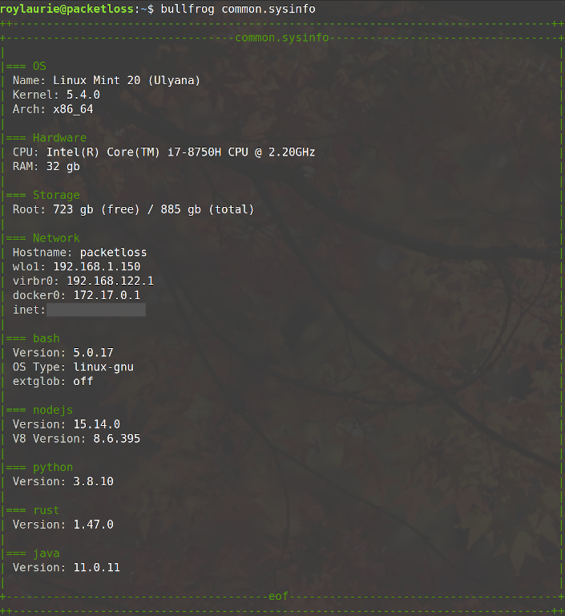

# bullfrog
*A bash command-line toolkit for building command-line toolkits.*

# usage
`bullfrog [-options] <name.space> <operation> [--parameters]`

## options
Options adhere to standard getopts conventions.

`-a {app}` (*bullfrog*) Specifies a standalone bullfrog [-a]pp with its own config and imports.  
`-c {config}` (*default*) Specifies the [-c]onfiguration profile name to load on startup.  
`-f` (*disabled*) [-F]orces any commands that accept that option and automatically fills in prompts where possible.  
`-r {remote host}` (*disabled*) Runs the bullfrog command [-r]emotely via SSH on the host machine.  
`-x` (*disabled*) Enables internal debugging.  
`-X` (*disabled*) Enables language debugging.

## parameters
Parameters follow the format:  
`--my.param.name "value"`

A caveat of parameter naming rules is that they cannot be entirely numeric (e.g., --0 and --32 are illegal).

## naming rules
Namespaces, operations, and parameter names all adhere to the same validation rules.
  
Names consist of one or more lowercase *a-z* and *0-9* characters and may be separated by a single **.** (dot) character.
 
## module structure
Each bullfrog package provides a namespace configuration that links multiple fully qualified namespaces to their respective bash scripts, known as modules.
  
The module script for the provided namespace is sourced by bullfrog on startup. Bullfrog calls the appropriate function within that module script for the operation specified by the user. Any parameters provided are pre-validated based on the package's configuration and passed to the operation function.

----

## license
Copyright (c) 2021 Asmov LLC  
Licensed under GPL v3  

This program is free software: you can redistribute it and/or modify
it under the terms of the GNU General Public License as published by
the Free Software Foundation, either version 3 of the License, or
(at your option) any later version.

This program is distributed in the hope that it will be useful,
but WITHOUT ANY WARRANTY; without even the implied warranty of
MERCHANTABILITY or FITNESS FOR A PARTICULAR PURPOSE.  See the
GNU General Public License for more details.

You should have received a copy of the GNU General Public License
along with this program.  If not, see <https://www.gnu.org/licenses/>.  
